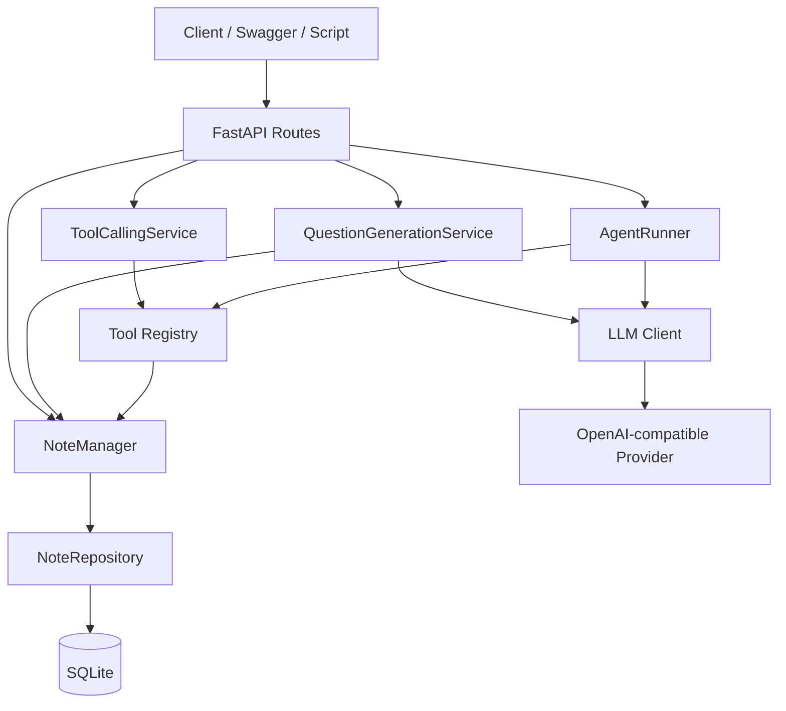

# AI Interview Learning Agent

一个面向算法与计算机基础复习的 AI 学习后端。

项目以“知识笔记 → 面试问题 → 工具检索 → Agent 辅助复习”为主链路，重点练习真实 AI 应用工程中的模型封装、结构化输出、流式响应、Tool Calling、受控 Agent 循环、数据持久化和自动化测试。

> 当前阶段：Day 9 · 受控 Agent Runner
> 当前实现为单用户、单实例学习型 MVP，后续将继续加入上下文管理、摘要记忆、Markdown RAG、可靠性策略和部署能力。

---

## 项目目标

本项目不是一个简单的聊天接口，而是一个可持续演进的个人 AI 学习工作区。

当前第一个垂直模块是 **AI Interview Learning Agent**，用于：

- 管理算法与计算机基础知识笔记；
- 根据笔记生成结构化面试问题；
- 通过 SSE 实时展示模型生成过程；
- 让模型调用受控的只读笔记工具；
- 通过有最大步数限制的 Agent 循环完成多步复习任务；
- 保留明确的领域边界、错误语义和测试基线。

长期目标是将同一套工程能力扩展到技术学习、英语学习、知识库检索和个人工作流等模块。

---

## 已实现能力

### 知识笔记

- Notes REST CRUD；
- 标题、分类、正文和掌握程度管理；
- `new / learning / familiar / mastered` 有限状态；
- 分类和掌握程度筛选；
- SQLite 持久化；
- SQLAlchemy Repository；
- 每个请求独立数据库 Session。

### 结构化问题生成

- 兼容 OpenAI Chat Completions 协议的 LLM Client；
- 根据指定笔记生成面试问题；
- 支持问题难度与数量控制；
- 模型 JSON 输出经过 Pydantic 校验；
- 额外验证问题数量和难度；
- 记录模型名称、Token usage 和调用耗时；
- 将配置错误、超时、上游错误和非法模型输出映射为明确 HTTP 错误。

### SSE 流式输出

- 上游模型流式响应解析；
- 下游 `text/event-stream`；
- `started / delta / completed / error` 事件；
- 首 Token 延迟与总耗时记录；
- 完整内容生成结束后再次进行结构验证；
- 区分流开始前 HTTP 错误和流开始后 SSE 错误；
- 检查客户端断开；
- 关闭常见反向代理缓冲。

### Native Tool Calling

当前注册三个只读工具：

- `get_note`：根据 ID 获取一条笔记；
- `search_notes`：根据关键词和分类搜索笔记；
- `get_weak_topics`：查询掌握程度为 `new` 或 `learning` 的知识点。

工具执行遵循：

```text
模型提出工具调用
→ Tool Registry 检查白名单
→ JSON 解析
→ Pydantic 参数校验
→ 后端 Handler 执行
→ 返回结构化工具结果
```

模型不能直接执行任意 Python 函数，也不能绕过 Tool Registry 访问数据库。

### 受控 Agent Runner

- 多轮模型决策与工具执行；
- 工具结果写回模型消息历史；
- 每个模型回合最多执行一个工具；
- 最大模型调用步数；
- 最后一个回合强制关闭工具调用并生成最终答案；
- 完全重复工具调用检测；
- JSON 参数键顺序归一化；
- 聚合每轮 Token usage；
- 保存可观察步骤，但不记录或暴露隐藏推理；
- 安全日志只记录步骤、工具名、参数字段名、耗时和结果状态。

---

## 系统架构



### 分层职责

| 层 | 职责 |
|---|---|
| API | HTTP 请求、响应 Schema、状态码与 SSE 编码 |
| Service | 业务用例、模型调用编排、Agent 循环 |
| Domain | 笔记、问题、Agent Step 等核心对象 |
| Repository | 数据访问边界 |
| LLM Client | 供应商请求、响应解析和错误归一化 |
| Tool Registry | 工具白名单、参数校验和安全执行 |
| Database | SQLite 持久化 |

---

## 技术栈

- Python 3.12+
- FastAPI
- Pydantic v2
- SQLAlchemy 2
- SQLite
- HTTPX
- pytest
- OpenAI-compatible Chat Completions API
- Server-Sent Events

---

## 项目结构

```text
ai-interview-agent/
├── app/
│   ├── agent/          # Agent 异常与运行结果模型
│   ├── api/            # FastAPI 路由、Schema、依赖注入、SSE
│   ├── core/           # 环境配置
│   ├── db/             # Engine、Session、ORM Base、初始化
│   ├── domain/         # 笔记与面试领域对象
│   ├── llm/            # LLM Client、内部模型、异常
│   ├── prompts/        # 问题生成、工具选择、Agent Prompt
│   ├── repositories/   # Repository 接口与 SQLAlchemy 实现
│   ├── services/       # 问题生成、Tool Calling、Agent Runner
│   ├── tools/          # Tool Registry 与笔记工具
│   └── main.py         # 应用入口与全局异常处理
├── docs/
│   ├── audits/         # 代码审计记录
│   ├── learning/       # 每日学习笔记
│   └── backlog.md      # 两周任务清单
├── tests/              # API、Service、数据库、SSE、工具和 Agent 测试
├── .env.example
├── requirements.txt
└── README.md
```

---

## 快速开始

### 1. 克隆仓库

```bash
git clone https://github.com/tyRant-yun/ai-interview-agent.git
cd ai-interview-agent
```

### 2. 创建虚拟环境

Windows PowerShell：

```powershell
python -m venv .venv
.\.venv\Scripts\Activate.ps1
```

Linux / macOS：

```bash
python -m venv .venv
source .venv/bin/activate
```

### 3. 安装依赖

```bash
python -m pip install --upgrade pip
python -m pip install -r requirements.txt
```

### 4. 配置环境变量

Windows PowerShell：

```powershell
Copy-Item .env.example .env
```

Linux / macOS：

```bash
cp .env.example .env
```

编辑 `.env`：

```dotenv
DATABASE_URL=sqlite:///./app.db

LLM_API_BASE_URL=https://your-compatible-provider.example/v1
LLM_API_KEY=replace_me
LLM_MODEL=replace_me
LLM_TIMEOUT_SECONDS=30
LLM_STREAM_INCLUDE_USAGE=false
```

注意：

- `LLM_API_BASE_URL` 应包含兼容接口的 `/v1` 基础路径；
- 不要把真实 API Key 写入代码或提交到 Git；
- 不同兼容供应商对 JSON Mode、Tool Calling 和流式 usage 的支持可能不同。

### 5. 启动开发服务器

```bash
fastapi dev app/main.py
```

启动后访问：

- Swagger UI：`http://127.0.0.1:8000/docs`
- OpenAPI JSON：`http://127.0.0.1:8000/openapi.json`
- Health Check：`http://127.0.0.1:8000/health`

数据库表会在应用启动阶段自动创建。

---

## API 概览

| 方法 | 路径 | 说明 |
|---|---|---|
| GET | `/health` | 服务健康检查 |
| POST | `/notes` | 创建笔记 |
| GET | `/notes` | 查询笔记列表 |
| GET | `/notes/{note_id}` | 获取一条笔记 |
| PUT | `/notes/{note_id}` | 完整更新笔记 |
| DELETE | `/notes/{note_id}` | 删除笔记 |
| POST | `/interview/questions` | 非流式生成结构化问题 |
| POST | `/interview/questions/stream` | SSE 流式生成问题 |
| POST | `/tools/execute` | 单步 Tool Calling |
| POST | `/agent/run` | 运行受控多步 Agent |

---

## 使用示例

### 创建笔记

```http
POST /notes
Content-Type: application/json
```

```json
{
  "title": "TCP three-way handshake",
  "category": "computer-network",
  "content": "TCP uses SYN, SYN-ACK and ACK to establish a connection.",
  "mastery_level": "learning"
}
```

### 生成结构化问题

```http
POST /interview/questions
Content-Type: application/json
```

```json
{
  "note_id": 1,
  "difficulty": "basic",
  "question_count": 3
}
```

### SSE 流式生成

PowerShell：

```powershell
@'
{
  "note_id": 1,
  "difficulty": "basic",
  "question_count": 3
}
'@ | Set-Content stream-request.json

curl.exe -N `
  -X POST `
  "http://127.0.0.1:8000/interview/questions/stream" `
  -H "Content-Type: application/json" `
  --data-binary "@stream-request.json"
```

事件示例：

```text
event: started
data: {"note_id":1,"topic":"TCP three-way handshake","difficulty":"basic","question_count":3}

event: delta
data: {"text":"{\"questions\":["}

event: completed
data: {"note_id":1,"topic":"TCP three-way handshake","questions":[...],"first_token_ms":620,"duration_ms":3050}
```

### 单步 Tool Calling

```http
POST /tools/execute
Content-Type: application/json
```

```json
{
  "user_request": "查找我关于 TCP 三次握手的笔记"
}
```

### 运行 Agent

```http
POST /agent/run
Content-Type: application/json
```

```json
{
  "user_request": "根据我还没有掌握的计算机网络知识，给出一个有顺序的复习建议",
  "max_steps": 6
}
```

Agent 可能执行：

```text
Step 1: get_weak_topics
Step 2: get_note
Step 3: final answer
```

最后一个允许的模型回合会禁用工具，只允许综合已有工具结果生成最终回答。

---

## 错误语义

| HTTP / Event | 场景 |
|---|---|
| 404 | 笔记不存在 |
| 409 | 重复标题或受控 Agent 执行冲突 |
| 422 | 请求不符合 Pydantic Schema |
| 502 | 上游失败、非法模型输出或非法工具协议 |
| 503 | LLM 配置缺失 |
| 504 | 模型请求超时 |
| SSE `event: error` | 流开始后发生超时、上游错误或最终结构校验失败 |

模型输出和工具参数都被视为不可信外部输入。

---

## 测试

测试不需要访问真实模型，也不会消耗 Token。项目使用：

- 临时 SQLite 数据库；
- FastAPI dependency override；
- 可控的 `FakeLLMClient`；
- API、Service 和纯函数分层测试。

运行完整测试：

```bash
python -m compileall app tests
python -m pip check
python -m pytest -q
git diff --check
```

查看 pytest 收集结果：

```bash
python -m pytest --collect-only -q
```

当前仓库尚未配置 GitHub Actions，合并前需要在本地运行完整质量检查。

---

## 关键工程设计

### 模型输出不是可信数据

```text
模型文本
→ JSON 解析
→ Pydantic Schema
→ 业务数量与枚举检查
→ 可信应用结果
```

### Prompt 不是安全边界

Prompt 只表达期望。真正的约束来自：

- Pydantic；
- Tool Registry；
- Repository；
- 最大步数；
- 重复调用检测；
- 明确的错误处理。

### 模型不能直接执行工具

```text
模型生成 tool_call
→ 后端检查工具白名单
→ 验证参数
→ 后端执行
```

### Agent 是有预算的循环

```text
模型决策
→ 工具行动
→ 工具结果
→ 再次决策
→ 最终回答
```

Agent 受到以下限制：

- 每轮最多一个工具；
- 最大模型调用次数；
- 最终回答保留回合；
- 重复调用保护；
- 只读工具；
- 安全日志。

---

## 安全边界

当前已经实施：

- `.env` 和数据库文件不进入 Git；
- API Key 只从环境变量读取；
- 工具采用后端白名单；
- 工具参数使用 Pydantic；
- 当前工具全部只读；
- 日志不记录 API Key、Authorization Header 或隐藏推理；
- 工具输出被视为参考数据，不被视为系统指令；
- SSE 完成前的 partial delta 不会成为正式业务结果。

---

## 已知限制

当前版本仍是学习型 MVP：

- 仅支持单用户；
- SQLite 适合单实例，不适合多实例并发部署；
- 没有 Alembic 数据库迁移；
- 没有身份认证和权限系统；
- 没有对话历史持久化；
- 没有上下文窗口管理与摘要记忆；
- 没有 Markdown RAG；
- 没有完整重试、退避和幂等策略；
- 没有生产级监控；
- 没有 GitHub Actions；
- Agent 仅使用只读笔记工具；
- 不同 OpenAI-compatible Provider 的兼容程度可能不同。

---

## 后续路线

### Day 10：上下文与记忆

- 最近消息窗口；
- 上下文预算；
- 历史摘要压缩；
- 多轮对话状态。

### Day 11：最小 RAG

- 加载 Markdown；
- Chunk 切分；
- Embedding 与检索；
- 回答来源引用。

### Day 12：可靠性

- 有限重试；
- 指数退避；
- 幂等性；
- 日志与 Request ID；
- 上游错误信息脱敏。

### Day 13–14：协议与交付

- 最小 MCP Server；
- Ubuntu VPS 部署；
- Nginx 与 HTTPS；
- README、架构图、简历描述和模拟面试。

---

## 开发原则

1. 每次只实现一个明确功能；
2. 修改代码前先阅读相关模块并给出计划；
3. 保持 API、业务、模型、工具和数据库边界；
4. 模型输出一律按不可信输入处理；
5. 核心功能必须有自动化测试；
6. 修改后检查 Git diff；
7. 不提交密钥、数据库和本地环境文件；
8. 不记录或公开模型隐藏推理；
9. 不把未完成能力写入项目成果或简历。

---

## License

当前仓库尚未添加开源许可证。在明确使用范围前，请勿默认将代码视为已授权的开源项目。
